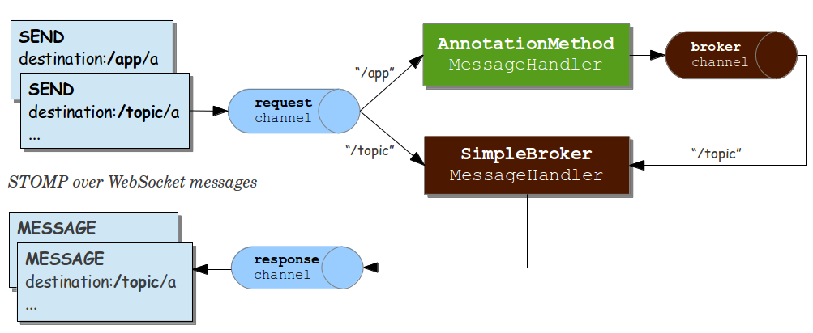

!SLIDE subsection
# STOMP in Spring Framework 4

!SLIDE smaller bullets incremental
# STOMP over WebSocket Support

* Easy to enable
* Application becomes STOMP broker to Web clients
* Annotated message-handling methods
* "Simple" broker for pub-sub-
* ...or full-featured message broker

!SLIDE smaller bullets incremental
# New `spring-messaging` module

* Includes STOMP support
* Message-handling annotations
* Key abstractions moved from Spring Integration (`Message`, `MessageChannel`, `MesageHandler`, ...)
* Foundation for WebSocket messaging architecture

!SLIDE smaller
# Configure STOMP over WebSocket

    @@@ java

    @Configuration
    @EnableWebSocketMessageBroker
    public class Config implements WebSocketMessageBrokerConfigurer {

      @Override
      public void registerStompEndpoints(StompEndpointRegistry reg) {
        reg.addEndpoint("/portfolio"); // WebSocket URL prefix
      }

      @Override
      public void configureMessageBroker(MessageBrokerConfigurer conf) {
        conf.enableSimpleBroker("/topic/"); // destination prefix
      }

    }

!SLIDE smaller bullets incremental
# Peer-to-Peer Pub-Sub

* Clients can now subscribe
* Clients can send and receive messages from peers
* No further server-side code required!
* "Simple" broker does it

!SLIDE smaller bullets incremental
# Add Application Logic

* Clients exchanging messages is useful, but-
* ...how to insert application logic, security, validation?
* **Answer:**  use annotated message-handling methods
* then publish to subscribed clients

!SLIDE smaller
# Annotated Message Handling
 
    @@@ java

    @Controller
    public class GreetingController {

      // Mapping based on "destination" header

      @MessageMapping("/greeting")

      public void greet(@MessageBody String greeting) {

      }

    }

!SLIDE smaller
# Annotated Message Handling
 
    @@@ java

    @Controller
    public class GreetingController {

      // Mapping based on "destination" header

      @MessageMapping("/greeting")
      @SendTo("/topic/greetings")
      public String greet(@MessageBody String greeting) {
          return "[" + getTimestamp() + "]: " + greeting;
      }

    }

!SLIDE smaller bullets incremental
# Send Messages Programmatically

* Publish messages from any part of application
* Inject `SimpMessagingTemplate`
* Call `convertAndSend` specifying destination
* Message sent to "broker" channel

!SLIDE smaller
# E.g. Publish from Spring MVC

    @@@ java

    @Controller
    public class GreetingController {

      @Autowired
      private SimpMessagingTemplate template;

      @RequestMapping(value="/greeting", method=POST)
      public void greet(String greeting) {
        String text = "[" + getTimeStamp() + "]:" + greeting;
        this.template.convertAndSend("/topic/greeting", text);
      }

    }

!SLIDE small center
# Message Flow
 

!SLIDE smaller
# Destination Prefixes

    @@@ java

    @Configuration
    @EnableWebSocketMessageBroker
    public class MyConfig implements WebSocketMessageBrokerConfigurer {

      @Override
      public void configureMessageBroker(MessageBrokerConfigurer conf) {
        conf.enableSimpleBroker("/topic/");
        conf.setApplicationPrefixes("/app");
      }

      // ...

    }

!SLIDE smaller bullets incremental
# Handling Subscriptions

* You can handle subscriptions
* And send data back directly (not involving the broker)
* Effectively, request-reply message pattern
* _(in traditional messaging app, this would have been command + temp queues)_

!SLIDE smaller
# Responding to a Subscription
## _(Request-Reply Pattern)_

    @@@ java

    @Controller
    public class PortfolioController {

      @SubscribeEvent("/positions")
      public List<PortfolioPosition> getPositions(Principal user) {
        Portfolio portfolio = ...
        return portfolio.getPositions();
      }

    }

