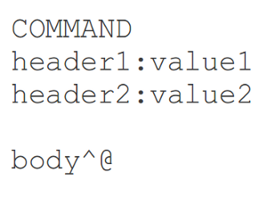
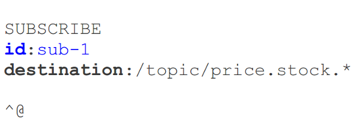
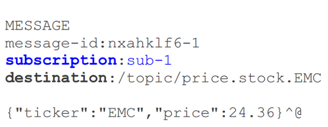

!SLIDE subsection
# STOMP

!SLIDE smaller bullets incremental
# [STOMP Protocol](http://stomp.github.io/index.html)

* Simple protocol for asynchronous message passing
* Originally for scripting languages (Ruby, Python)
* Supported by message brokers
* Suited for use on the web
* Frames modelled on HTTP

!SLIDE smaller center
# STOMP Frame Content
 

!SLIDE smaller bullets incremental
# Example Commands

* `SEND ===>>>`
* `SUBSCRIBE, UNSUBCRIBE ===>>>`
* `MESSAGE <<<===`
* `ERROR <<<===`
* `RECEIPT <<<===`
* `ACK, NACK ===>>>`

!SLIDE smaller bullets incremental
# The `"Destination"` Header

* A key concept in STOMP
* Opaque string, syntax left to server
* Typically URI path-like (`"/queue/a"`, `"/topic/a"`)
* Message brokers define semantics

!SLIDE smaller bullets incremental
# What Can a STOMP Client Do?

* Produce messages: _via SEND frame with "destination" header_
* Consume messages: _SUBSCRIBE frame w/ "destination" + MESSAGE frames from server_
* Server cannot send unsolicited messages!

!SLIDE smaller center
# Client as producer
 

!SLIDE smaller center
# Client as consumer
## (Subscription)
 

!SLIDE smaller center
# Client as consumer
## (Server sent message)
 

!SLIDE smaller center
# What using STOMP gives us-

!SLIDE smaller bullets incremental
# STOMP vs Raw WebSocket

* Standard message format
* Browser client support (e.g. [stomp.js](https://github.com/jmesnil/stomp-websocket), [msgs.js](https://github.com/cujojs/msgs))
* Common messaging patterns
* Ability to incorporate (full-featured) message broker

